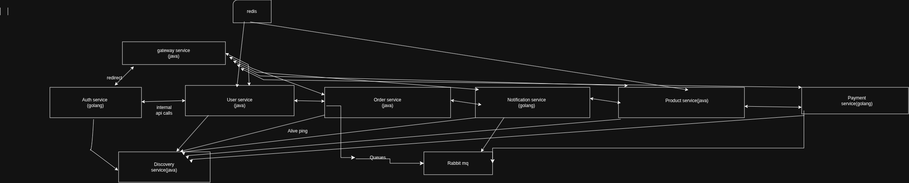

# Odery
A digital product ordering backend service written in <b>java</b> and <b>goLang</b> with microservice architecture and a well-thought-out system design implementation. Java services are <b>spring boot</b> while golang are <b>gin</b>
### Services

1. Auth services(GoLang) 
2. Gateway service(Java) 
3. User service(Java) 
4. Product service(Java) 
5. Order service(Java)
6. Payment service(GoLang)
7. Notification service(GoLang) 
8. Discovery service(Java) 

### Databases
1. Postgres
2. Mongo

User service uses postgres while notification,product,order and payment services all uses mongodb

### Cache
1. Redis

Used in User both Product services

### Messaging
1. RabbitMq

Implemented in product,order,payment and notification services

### Microservice diagram

### System design explanation
Api Gateway redirects all request to appropriate endpoint \n
User create account on user service \n
Logs in on auth service  
